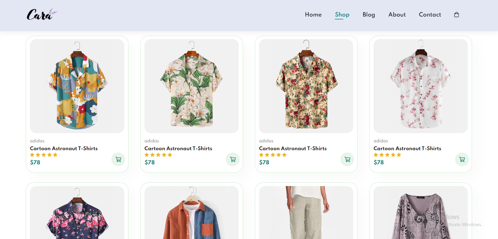

---

# 🛍️ Simple Static E-Commerce

A clean, responsive, and lightweight e-commerce storefront template built entirely with **HTML, CSS, and Vanilla JavaScript**. This project serves as a perfect example of how to structure a product catalog and handle product details without the need for a complex backend or database.

## 📖 Overview

This is a client-side application designed to showcase products in a modern grid layout. It demonstrates fundamental web development concepts such as DOM manipulation, responsive CSS Grid/Flexbox, and navigating between static pages. Because it is static, it is incredibly fast and can be hosted on any simple static hosting service (like GitHub Pages, Render or Netlify).

## 📸 Screenshots


 

## ✨ Key Features

* **Static Product Catalog:** A visually appealing grid layout displaying product thumbnails, titles, and prices.
* **Product Details:** Dedicated pages for individual items to view descriptions and larger images.
* **Responsive Design:** Fully optimized layout that adapts seamlessly from desktop monitors to mobile screens.
* **Zero Dependencies:** Runs on pure browser technologies—no frameworks, libraries, or backend servers required.

## 🛠️ Tech Stack

* **Structure:** HTML5
* **Styling:** CSS3 (Flexbox & Grid)
* **Interactivity:** Vanilla JavaScript (ES6)

## 🚀 How to Run

Since this is a static project, you do not need to install `npm` packages or set up a local server environment.

1. **Clone the repository:**
```bash
git clone https://github.com/Otormin/EcommerceWebsite.git

```


2. **Navigate to the folder:**
```bash
cd EcommerceWebsite

```


3. **Launch:**
Simply double-click the `index.html` file to open it in your default web browser.

```